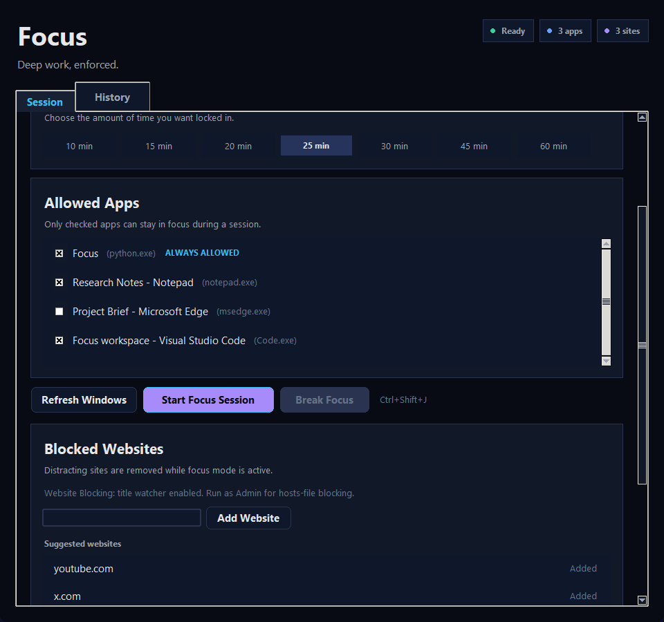

# Focus

**A deep-work enforcer for Windows.** Select the apps you need, pick a duration, and Focus locks you in — blocking every other window until your session is done.


<!-- Replace the line below with a real screenshot once the app is running -->


---

## Why

Every existing focus tool either just plays a sound when your time is up or relies on you to honour your own rules. Focus takes a different approach: it physically pulls you back to your allowed windows the moment you drift. No willpower required.

- **tmux / window managers** — great for layout, zero enforcement
- **Pomodoro timers** — count down, then do nothing
- **Website blockers** — only cover the browser, ignore every other app

Focus treats the *entire desktop* as the boundary.

---

## At a Glance

> Add short GIFs here. Suggested recordings (30–60 s each):

| Feature | Demo |
|---------|------|
| Starting a session and picking allowed windows | *(add GIF)* |
| Attempting to switch to a blocked app — getting yanked back | *(add GIF)* |
| Overlay timer counting up, turning green when goal is reached | *(add GIF)* |
| Adding blocked websites and having a tab auto-close | *(add GIF)* |
| Motivational dialog when quitting prematurely | *(add GIF)* |
| Session history tab showing total study time | *(add GIF)* |

---

## Features

### Enforcement
- **Window blocking** — hooks into the Windows foreground-change event and forces focus back to your last allowed window within 50 ms of any disallowed switch
- **Backup poll enforcer** — a 250 ms poll loop catches apps that steal focus back during their own startup (Office, browsers) after the event-triggered refocus already ran
- **Process-level allow list** — every window of an allowed app (every tab, every dialog) is permitted; you pick by process, not individual window titles
- **System tray** — the app hides to the tray so it never gets in your way; closing the window keeps the session running
- **Auto-focus on session start** — Focus brings its own window to the foreground the moment a session starts so you're never left on a blocked window

### Website Blocking
- **Hosts-file blocking** — injects `127.0.0.1` entries at session start and removes them cleanly at session end; works in every browser (requires admin, gracefully skipped if not elevated)
- **Chromium tab watcher** — monitors window title changes via a WinEvent hook and sends `Ctrl+W` to close any Chromium tab that navigates to a blocked domain; covers Chrome, Edge, Brave, Opera, Vivaldi
- **Persistent blocklist** — the domain list is stored in SQLite and survives app restarts; edit it at any time from the Session tab

### Timer & Overlay
- **Configurable sessions** — 10, 15, 20, 25, 30, 45, or 60 minutes
- **Always-on-top overlay** — a compact floating timer that lives above every window, click-through by default so it never interrupts you
- **Drag mode** — unlock the overlay with `Ctrl+Shift+M` to reposition it, lock again to make it click-through
- **Silent goal completion** — when you hit your goal the overlay turns green and the session keeps running; no dialog, no interruption

### End-of-session
- **Motivational exit dialog** — if you try to quit *before* your goal, Focus shows three motivational prompts with a countdown before the exit button unlocks; each requires 5 seconds of reflection
- **Frictionless exit after goal** — once your goal is reached, `Ctrl+Shift+J`, the End Session button, and tray → Exit all quit immediately with no dialog
- **Session history** — every session is saved to a local SQLite database; the History tab shows date, start/end times, duration, and allowed windows alongside a running total

---

## Install

### Option 1 — Download the executable

1. Go to [Releases](../../releases) and download `Focus.exe`
2. Double-click to run — no Python required

### Option 2 — Run from source

**Requirements:** Python 3.12+, Windows 10/11

```bash
git clone https://github.com/Albertovh05/Focus.git
cd Focus
pip install -r requirements.txt
python main.py
```

### Option 3 — Build the executable yourself

```bash
pip install -r requirements.txt
build.bat
# Output: dist/Focus.exe
```

---

## Keyboard Shortcuts

| Action | Shortcut |
|--------|----------|
| End session (or trigger motivational dialog) | `Ctrl+Shift+J` |
| Toggle overlay drag mode | `Ctrl+Shift+M` |

---

## Architecture

```
┌──────────────────────────────────────────────────────────┐
│                     FocusApp (main.py)                    │
│    tkinter mainloop  ·  tray icon  ·  session wiring     │
└────────┬─────────────────────┬──────────────────┬────────┘
         │                     │                  │
         ▼                     ▼                  ▼
┌────────────────┐  ┌────────────────────┐  ┌──────────────┐
│ OverlayWindow  │  │  SessionManager    │  │  SiteBlocker │
│ (overlay.py)   │  │ (session_manager)  │  │(site_blocker)│
│                │  │                    │  │              │
│ Always-on-top  │  │ _hook_thread       │  │ _hook_thread │
│ click-through  │  │ EVENT_SYS_FG hook  │  │ NAME_CHANGE  │
│ draggable      │  │ _timer_thread (1s) │  │ hook         │
└────────────────┘  │ _poll_thread(250ms)│  │ hosts-file   │
                    └────────────────────┘  └──────────────┘
┌────────────────┐
│  db.py         │
│  SQLite:       │
│  sessions +    │
│  blocked_      │
│  domains       │
└────────────────┘
```

**Threading model**

| Thread | Role |
|--------|------|
| Main | tkinter `mainloop`, all UI updates |
| `_hook_thread` (SessionManager) | Windows message loop for `EVENT_SYSTEM_FOREGROUND` WinEvent hook |
| `_timer_thread` | Fires `on_tick` every second |
| `_poll_thread` | 250 ms backup enforcer — catches apps that steal focus after the event-triggered refocus |
| `_hook_thread` (SiteBlocker) | Windows message loop for `EVENT_OBJECT_NAMECHANGE`; only active when blocked domains are set |
| pystray thread (daemon) | System tray icon message loop |

---

## Repo Layout

```
Focus/
├── main.py              # UI, tray icon, session wiring, dialogs
├── session_manager.py   # WinEvent hook and window enforcement
├── site_blocker.py      # Website blocking: hosts-file + Chromium tab watcher
├── overlay.py           # Always-on-top draggable timer overlay
├── db.py                # SQLite: sessions + blocked domains
├── icon_gen.py          # Generates focus_icon.ico at startup if missing
├── requirements.txt     # Python dependencies
├── build.bat            # One-command PyInstaller build
├── Focus.spec           # PyInstaller spec (single-file exe, no console)
└── SETUP.md             # Dev environment setup notes
```

---

## Tech Stack

| Library | Version | Role |
|---------|---------|------|
| Python | 3.12+ | Runtime |
| tkinter | stdlib | UI and dialogs |
| pywin32 | 307+ | WinEvent hook, `SetForegroundWindow`, thread input |
| psutil | 5.9+ | Resolve window handle → process name |
| pystray | 0.19+ | System tray icon |
| Pillow | 10+ | Tray icon image loading |
| keyboard | 0.13.5+ | Global hotkeys and `Ctrl+W` tab closing |
| PyInstaller | 6+ | Single-file `.exe` packaging |
| SQLite | stdlib | Session history and blocked-domain list |

---

## Roadmap

- [ ] Custom duration input (not just preset chips)
- [ ] Break reminders between sessions
- [ ] macOS / Linux support
- [ ] Per-session notes / goals
- [ ] Weekly / monthly study time charts
- [ ] Dark/light theme toggle
